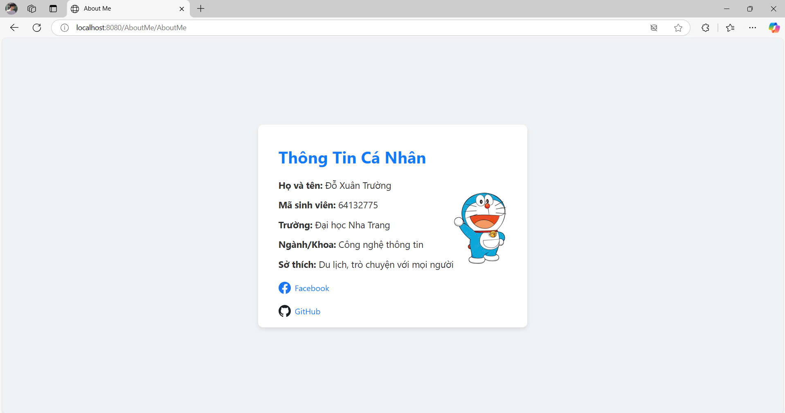

# Phát triển ứng dụng Web 2
- Tên sinh viên: Đỗ Xuân Trường
- MSSV: 64132775
- Email: truong.dx.64cntt@ntu.edu.vn

## Danh mục các bài tập
1. [Bài tập 1: About Me](https://github.com/Truongdoxuan/64132775_Web2/tree/main/AboutMe)
2. [Bài tập 2: BMI](https://github.com/Truongdoxuan/64132775_Web2/tree/main/BMI)
3. [Bài tập 3: Tính toán](https://github.com/Truongdoxuan/64132775_Web2/tree/main/Example_TinhToan)
4. [Bài tập 4: Login](https://github.com/Truongdoxuan/64132775_Web2/tree/main/Login)
5. [Bài tập 5: Truyền dữ liệu sang View (String Boot)](https://github.com/Truongdoxuan/64132775_Web2/tree/main/SB_TruyenDuLieuSangView)

## Bài tập 1: About Me - Giới thiệu về tôi

**Mô tả:** Xây dựng servlet AboutMe, thực hiện yêu cầu khi client gửi GET request http://localhost/AboutMe và sau đó Servlet gửi đáp ứng các thông tin cá nhân của mình.

- **Đường dẫn:** [About Me](https://github.com/Truongdoxuan/64132775_Web2/tree/main/AboutMe)
- **Main file:** [AboutMe.java](AboutMe/src/main/java/truongdx/exercise1_3/AboutMe.java)
  
